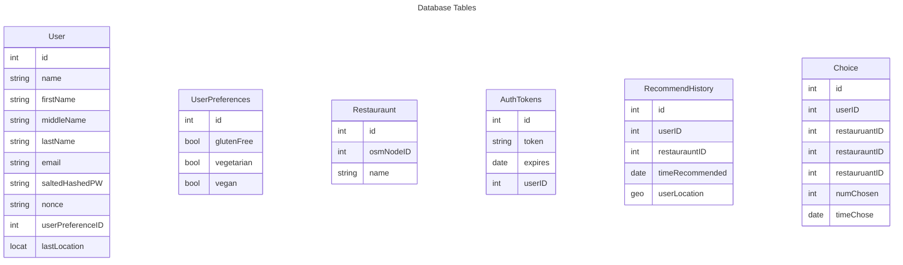

# Database Tables Documentation

Diagram of the tables present within the DB

## Diagram

```mermaid
---
title: Database Tables
---
erDiagram
    User {
    	int		id
        string	name
		string 	firstName
		string	middleName
		string	lastName
        string	email
        string	saltedHashedPW
        string  nonce
		int		userPreferenceID
		locat	lastLocation
    }
	UserPreferences {
		int id
		bool	glutenFree
        bool	vegetarian
        bool	vegan
	}
	Restauraunt {
    	int 	id
		int		osmNodeID
        string	name
    }
    AuthTokens {
    	int		id
        string	token
        date	expires
        int		userID
    }
	RecommendHistory {
    	int		id
        int		userID
        int		restaurauntID
        date	timeRecommended
        geo		userLocation
    }
    Choice {
        int 	id
        int		userID
        int		restauruantID
        int		restaurauntID
        int		restauruantID
        int		numChosen
        date	timeChose
    }
```
